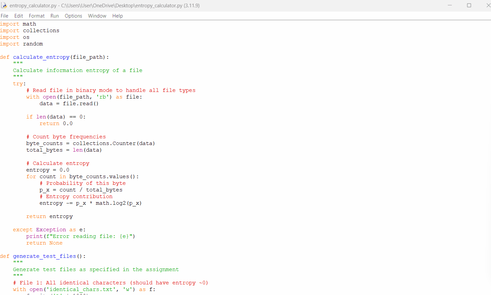

# File Entropy Calculator

## Assignment: Practical Assignment 2 - File Entropy Calculation

### Program Features:
- Calculates character frequencies in files
- Computes information entropy using Shannon's formula
- Tests various file types to verify entropy principles

### Results:
| File Type | Entropy | Expected Behavior | Verified |
|-----------|---------|-------------------|----------|
| Identical characters | 0.0000 bits | Approaches 0 | ✅ |
| Random binary (0/1) | 0.9992 bits | Approaches log₂(2) = 1 | ✅ |
| Random bytes (0-255) | 7.7975 bits | Approaches log₂(256) = 8 | ✅ |
| Medium entropy text | 3.9759 bits | Intermediate value | ✅ |

### Demonstration:

### Requirements Met:
- ✅ Program calculates character frequencies
- ✅ Computes entropy correctly
- ✅ Verifies entropy approaches 0 for predictable data
- ✅ Verifies entropy approaches log₂(alphabet_size) for random data
- ✅ GIF demonstration included
- ✅ Code and files in Git repository